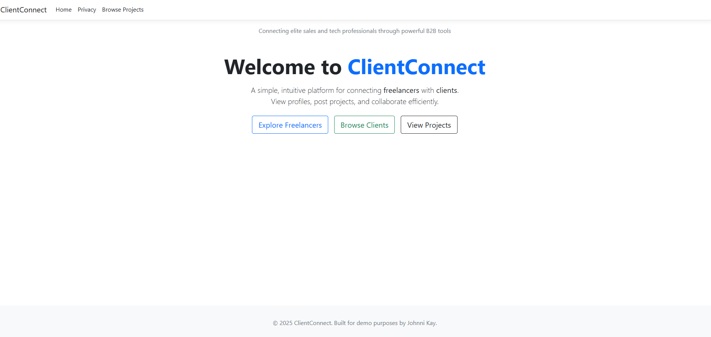
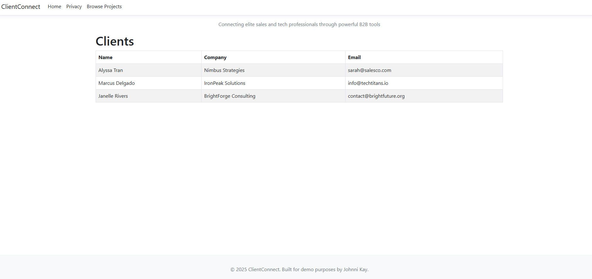
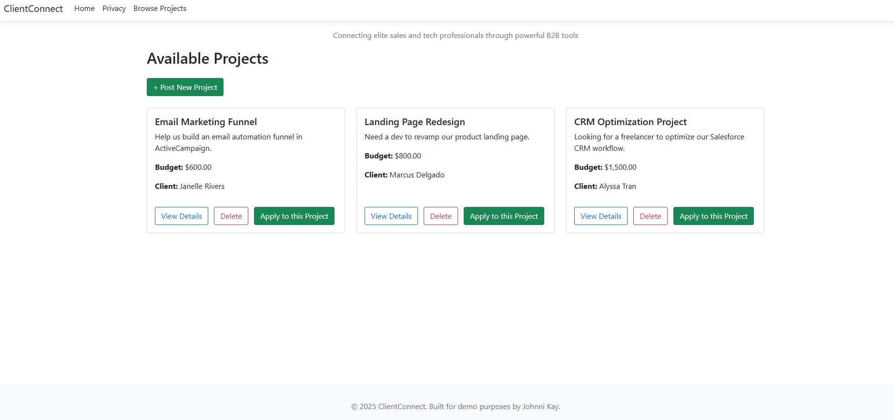
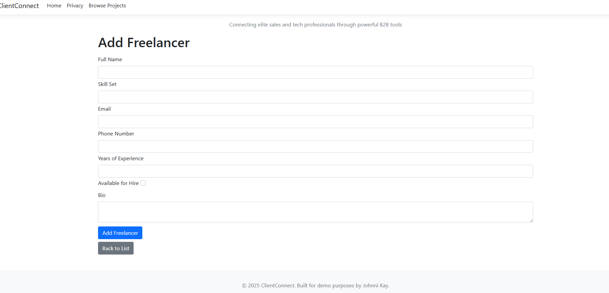
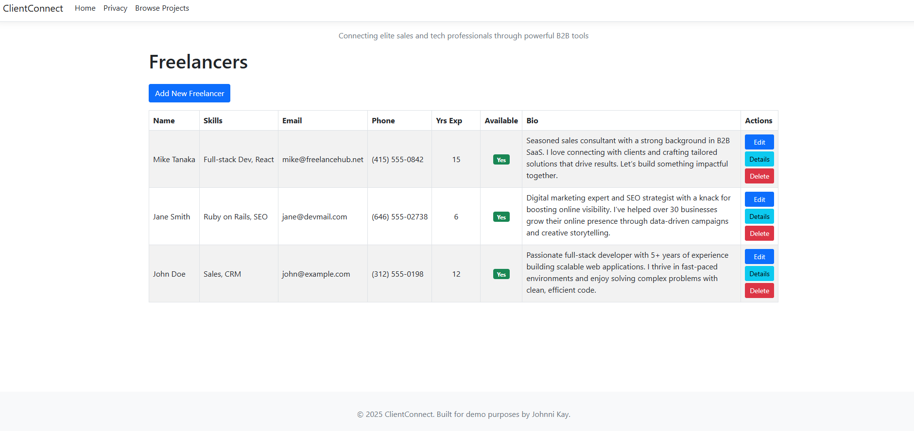

# TalentBridge

TalentBridge is a professional-grade mock B2B freelancer marketplace built with ASP.NET Core MVC. It connects freelance sales and tech professionals with clients who need expert solutions. This project showcases full-stack development skills, including backend logic, Razor view rendering, controller architecture, and a dynamic application system.

## Features

- **Client Accounts** – Create and manage project listings.
- **Freelancer Profiles** – Apply to projects with cover letters.
- **Project Listings** – Browse and manage open freelance opportunities.
- **Apply to Projects** – Freelancers can submit tailored applications.
- **In-Memory Database** – Fast and simple development storage.
- **Clean Code** – Well-organized and fully commented to emphasize clarity.

## Tech Stack

Language: C# + HTML

Framework: ASP.NET Core MVC

Database: Entity Framework Core (InMemory)

Views: Razor Pages (.cshtml)

IDE: Visual Studio 2022

Version Control: Git + GitHub

## Why TalentBridge?

This project simulates a real-world platform where clients and freelancers connect. It was designed to demonstrate the ability to build scalable, maintainable web applications that reflect production-level standards. The modular approach, MVC architecture, and focus on usability reflect industry expectations and best practices.

## 📸 Screenshots

A quick look at the core functionality of **TalentBridge**:

### Home Page
Displays a welcoming overview and navigation to core features.

### Clients Page
Browse registered clients.

### Available Projects
Explore project listings submitted by clients and add new ones.

### Add New Freelancer
Register a new freelancer to the platform.

### All Freelancers
View all freelancers and their details.

## Future Enhancements

Implement authentication and authorization

Upgrade to SQL Server for persistent storage

Add direct messaging and notifications

Improve mobile responsiveness and UI styling

## About the Developer

I'm an early-career full-stack developer with a background in game development and hands-on experience with web technologies and SEO. I focus on writing clean, well-structured code and building applications that are intuitive and purposeful. I’m always looking to learn and improve, and I enjoy creating projects that reflect both technical growth and real-world problem solving.

TalentBridge was built to demonstrate my ability to take a concept from idea to working application — handling everything from backend logic to user experience. It highlights my full-stack capabilities and reflects a strong understanding of how to design and implement features that deliver value to users.

Portfolio: [johnnikay.dev](https://johnnikay.dev)  
GitHub: [@JohnniKay](https://github.com/JohnniKay)  
LinkedIn: [linkedin.com/in/johnnikay](https://www.linkedin.com/in/johnnibeal)

